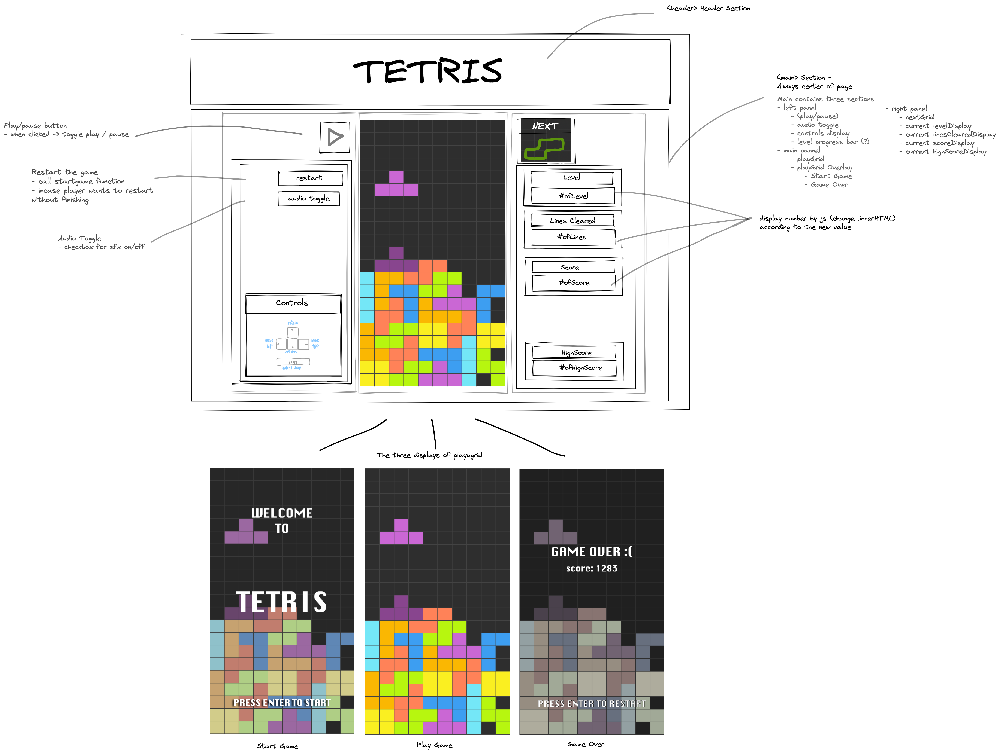

# Project 1 - Grid Game : Tetris

## Description
This Tetris game is my first project after three weeks of General Assembly's Software Engineering Immersive course. The aim for this project is to recreate a grid game with choices to choose from. Tetris is a definitely a challenge to construct with three weeks into HTML, CSS, and JavaScript, however I wanted to push my limits and learn the most out of this project. I have always loved playing Tetris, therefore it was easily my choice for this project.

**Timeframe** = 7 Days | Solo Project

## Deployment Link
The project is: https://fasaic.github.io/sei-Tetris/


## Technologies Used
- HTML5
- CSS3
- JAVASCRIPT
- Git
- GitHub
- VSCode
- Google Chrome Dev Tools
- Google Fonts

## Overview
Tetris is a puzzle game that involved 7 different types of shapes that falls onto the play grid one at a time. While the shape falls down the grid, the player can rotate the shape and to guide the shape to the desired position. The shapes stack on top of each other until a row or horizontal line is complete, where it will then be cleared from the grid. The goal of this game is to align the shapes to create as much horizontal line as possible to gain the highest score. 

## Planning
On Day 1 of the project, I started the process by brainstorming the required components of the game and thinking of what parts I woud like to have in my version. I would like to have three main sections on the page including the left panel, the playgrid, and the right panel each with the parts as follow:

**Game Components**
- Left Panel: Play/Pause Button, Restart button, Audio button, Controls display
- Play Grid: 10W x 20H grid (200 cells), Shapes
- Right Panel: Next Grid, Levels, Line Cleared, Score, HighScore


From this, I created a wireframe of what the page will look like:



I would like to have the start page and game over page displayed as an overlay of the main playgrid if possible, so those were also drafted out. 

While doing this, I manually visualized the grid and its size


There are seven shapes that is required, each with a different rotation pattern. To make it more clear, I visualized the shapes onto the grid with labeled cell numbers to see the rotation pattern.


**Game Flow**

I then listed out the flow of the game, and start with the Psuedo code as follows:

*Start of game*
- The player is greeted with the start page, The player enters the game --> the shape starts to fall into the grid
- A shape must be generated randomly to display on the next-grid, there that shape will be the next shape that falls after the current shape
- At the start of the game, a new shape must be generated as the current shape. After the first round, the current shape will be equal to the shape earlier generated in for the next-grid

*Movements* 
- The player can rotate the shape, moves left and right, and down
- The player can hard drop the shape to let it move to the end position instantly

*Rotation*
- Each shape has different offset from the start position to rotations 1, 2, 3 and 4
- Each time player presses Up (Arrow Key), cycle through rotation array offsets
- Need conditions to check if the shape has to be shifted to prevent overflow of the edges and the bottom of the grid, including the surrounding shapes.

*Moving Down*
- A shape moving down means that a color class of the moving shape has to be removed from the current position, and added to a new position on the grid, one cell below (+10 of the cell index).
- It has to be checked if it is possible for the shape to continue to move down before executing the actual move.
- The shape cannot move down if the next position exceeds the bottom of the grid
- The shape cannot move down if the next position includes other shape that had landed on the grid
- If the shapes line up at the top of the grid -> game over

*Shape reaches landing position*
- shape color changes from moving to landed color scheme
- Must check if the line is cleared
- start new interval for next shape

*When Line Clears*
- Check which rows are cleared
- Create array of rows from the cells inorder to itirate to check
- Adds the score, check the score and level

##  Code Process 

On the Second day, I created the grid, sample shapes to test the concepts, and started on the rotation function since it is one of the most challenging aspect of the game.

**Creating Grid**

I first created a simple page layout with HTML and Basic CSS Styling. I then used Javascript to create both grids, the playGrid and the nextGrid using a forLoop and DOM manipulation:
```  
  function makeGrid(cellCount, cells, gridDiv) {
    for (let i = 0; i < cellCount; i++) {
      const cell = document.createElement('div')
      // cell.innerText = i
      // cell.style.fontSize = '0.6rem'
      cell.dataset.index = i
      cells.push(cell)
      gridDiv.appendChild(cell)
    }
    console.log(cells)
  }

  makeGrid(playCellCount, playCells, playGrid)
  makeGrid(nextCellCount, nextCells, nextGrid)

  ```
  

**Creating Shape**

The shapes should include a starting position, and the rotation offset array. Therefore, I decided to create an object class with three main values, the shape's name, the shape's start Position, and the shape's rotation array. The object also includes the classes name to be called, included inn `this.moving` and `this.landed`. This is a way to ease the process of calling the class name with different shapes. The seven shapes are created using this method. The start postiion are negative since at the start of the game, when the moveDown function is executed, it adds 10 to the shape's position to move down immediately. 

```

  class Shape {
    constructor(shape, startPos, rot) {
      this.shape = shape
      this.startPos = startPos
      this.currentPos = startPos
      this.nextPos = this.currentPos
      this.rot = rot
      this.moving = 'moving' + shape
      this.landed = 'landed' + shape
    }
  }

  const shape1 = new Shape('O', [-6, -5, 4, 5], {
    one: [0, 0, 0, 0],
    two: [0, 0, 0, 0],
    three: [0, 0, 0, 0],
    four: [0, 0, 0, 0]
  }) 

  const shape2 = new Shape('I', [-7, -6, -5, -4], {
    one: [18, 9, 0, -9],
    two: [2, 11, 20, 29],
    three: [18, 9, 0, -9],
    four: [-18, -9, 0, 9]
  })

  ```

**Randomizing Shape**

The first trial of randomizing shape is generating a random number from 1 to 7, and have that equal the current shape. However, the shape is not distributed causing many repetitive shapes which ruins the purpose of the game. Therefore, I created a condition for randomizing the shapes, for the new randomized shape must not be the same shape as the past five shapes by storing them in an array, and randomizing again if the new shape duplicates the existing array of shape history

```
  const randomHist = []
  function randomizeShape() {
    let random = Math.floor(Math.random() * 7 + 1)
    if (randomHist.length < 2) {
      randomHist.push(random)
    } else if (randomHist.length < 5) {
      while (randomHist.some(item => item === random)) {
        random = Math.floor(Math.random() * 7 + 1)
        // console.log('looping1')
      }
      randomHist.push(random)
    } else if (randomHist.length >= 5) {
      while (randomHist.some(item => item === random)) {
        random = Math.floor(Math.random() * 7 + 1)
        // console.log('looping2')
      }
      randomHist.shift()
      randomHist.push(random)
    }
    return eval(`shape${random}`)
  }
  ```
**Dropping Shapes**

This is the main function that executes the game. It is the game flow, where it first checks if there is a moving shape in the grid. That indicates that it is not the first drop from the start of the game, therefore the current shape to be dropped after the moving shape has 'landed' is the nextShape that has been randomized.

```
  function drop() {
    playGrid.classList.remove('shake')
    // IS THERE A MOVING SHAPE IN THE GRID?
    if (playCells.some(cell => cell.className.includes('moving'))) {
      // Check if it hits buttom or cells with landed shape
      if (shape.currentPos.some(index => (index + playWidth) >= playCellCount) || shape.currentPos.some(index => playCells[index + playWidth].className.includes('landed'))) {
        remove()
        deactivate()
        checkClearedRow()
        shape = nextShape
        // Move still valid --> continue to move
      } else {
        remove()
        moveDown()
      }
      timer = setTimeout(drop, time)

      // THERE IS NO ACTIVE SHAPE ( FIRST DROP AT START)
    } else {
      if (nextShape === null) {
        shape = randomizeShape()
      } else {
        // Shape in playGrid = nextShape that has been randomed
        shape = nextShape
        // Reset the start position of the shape (incase there is a shape already in the playGrid)
        shape.currentPos = shape.startPos
        // Reset rotation iteration
        r = 0
        // Remove the current shape displayed on nextGrid as it is now the current
        nextShapeRemove()
      }

      // Generate Random Next Shape and display on nextGrid
      nextShape = randomizeShape()
      nextShapeDisplay()
      // GAMEOVER FUNCTION, 
      if (playCellRows[0].some(item => item.className.includes('landed'))) {
        gameOver()
        return
      }
      moveDown()
      timer = setTimeout(drop, time)
      // // console.log('CURRENT SHAPE DROP', shape.shape)
    }
  }
  ```
**Next Shape & Next Shape Display**

In order for the next shape to display, since the grid starts at index 0, each co-ordinate of the shape has to be offset to fit the nextGrid 
```
  function nextShapeDisplay() {
    nextDisplayPos = nextShape.startPos.map(cell => cell + 20)
    nextDisplayPos = nextDisplayPos.map(cell => {
      if (cell <= 6) {
        return cell -= 3
      } else if (cell <= 16) {
        return cell -= 9
      } else if (cell <= 26) {
        return cell -= 15
      } else if (cell <= 36) {
        if (nextShape.shape === 'Z') {
          return cell -= 13
        } else {
          return cell -= 9
        }
      }
    })
    nextDisplayPos.forEach(index => nextCells[index].classList.add(nextShape.moving))
  }

  // REMOVE FROM GRID
  function nextShapeRemove() {
    nextDisplayPos.forEach(index => nextCells[index].classList.remove(shape.moving))
  }
  ```


  **Rotation of Shapes**

This function is one of the most challenging functions of the project. I first have the r variable that indicates the rotation index of the rotation array of the shape, where it cycles from 0, 1, 2, and 3. This matches the shape's rotation index which could be obtained. The first rotation index for shape I has to be different from the one set in the array since it was first set to prevent the shape from overflowing the top of the grid when it rotates in the top cells.

Before conducting the actual rotate, it first tests the rotate to see if it is out of bound or if it is possible for the shape to rotate. A testRotate variable was created and set to equal the current position of the shape, then added each index with the rotation offset of each item. 
```
  function rotate() {
    let testRotate = [0, 0, 0, 0]
    let didItRotate = true


    // ROTATION 
    r++
    if (r > 3) {
      r = 0
    }

    // GET ROTATION ARRAY
    if (r === 1 && shape.shape === 'I' && shape.currentPos.some(item => item > 39)) {
      rot = [-18, -9, 0, 9]
    } else {
      rot = Object.values(shape.rot)[r]
    }

    // ROTATE
    testRotate = shape.currentPos
    testRotate = testRotate.map(item => item + 0)
    for (let i = 0; i < 4; i++) {
      testRotate[i] = testRotate[i] + parseFloat(rot[i])
    }
```

After the testRotate array has been created, it has to go through conditions to set the shift of the shape when it overflows the edges and the bottom of the grid. There are many conditions with different shifts for each shape.

```
    if ((r === 2 || r === 0) && (testRotate[0] === testRotate[3] - 3) && (testRotate[0] % playWidth === 8) && (testRotate[3] % playWidth === 1)) {
      shift += 2
    } else if (testRotate.every(item => item % playWidth === 9)) {
      shift += 1
    } else if ((r === 2) && testRotate.some(item => item % playWidth === 2)) {
      shift += 0

```
The selected shift that matches the current condition was added to the rotated array, to get the final position, then if the final position includes landed shape, the rotation will not execute and the shape remains in the current position.


```
    testRotate = testRotate.map(item => item + shift)
    if (shape.shape === 'I' && (r === 1 || r === 3)) {
      didItRotate = true
      startRotate(shift)
    } else if (testRotate.some(index => playCells[index].className.includes('landed'))) {
      console.log('CANNOT ROTATE')
      didItRotate = false
      console.log('existing position (no rotate done)', shape.currentPos)

      r -= 1
    } else {
      didItRotate = true
      startRotate(shift)
      console.log('START ROTATE')
      shift = 0
    }

  function startRotate(offset) {
    for (let i = 0; i < 4; i++) {
      // console.log('CURRENT POSITION', shape.currentPos)
      remove()
      shape.currentPos[i] = shape.currentPos[i] + parseFloat(rot[i])
    }
    shape.currentPos.forEach(index => playCells[index + offset].classList.add(shape.moving))
    shape.currentPos = shape.currentPos.map(index => index + offset)
  }
```

**Shape Movements**

These are the functions that together when combined in the drop function, to do with removing or adding classes for the shape be moved down, deactivated, and removed.

```
  // * REMOVE CURRENT POSITION CLASS
  function remove() {
    shape.currentPos.forEach(index => playCells[index].classList.remove(shape.moving))
    //// console.log('removed', shape.currentPos)
  }

  // * MOVE THE SHAPE DOWN BY 1 ROW
  function moveDown() {
    shape.currentPos.forEach(index => playCells[index + 10].classList.add(shape.moving))
    shape.currentPos = shape.currentPos.map(index => index + 10)
  }

  // * DEACTIVATE SHAPE
  function deactivate() {
    soundInActive.play()
    shape.currentPos.forEach(index => playCells[index].classList.add(shape.landed))
    shape.currentPos.forEach(index => playCells[index].classList.remove(shape.moving))
  }
```


**Lines Cleared**

To check if a row is cleared, an array for cell rows including 20 rows were iterated from the bottom to top row to check if every cell in the row contains landed shape. If it contains landed shape, that row is pushed to a new array containing only cleared rows. the line count and line score and the level is also checked at this moment. 

```

  function checkClearedRow() {
    clearedRowCount = 0
    clearedRow = []

    for (let i = 19; i >= 0; i--) {

      if (playCellRows[i].every(item => item.className.includes('landed'))) {
        clearedRow.push(i)
        clearedRowCount += 1
        lineScore = lineScore + 1
        lineScoreText.innerHTML = lineScore
        checkLevel()
        playGrid.classList.add('shake')
      }
    }
```

The clearedRow array was then iterated from the bottom to top, first removing the current moving class name one row at a time. It then goes through a condition where it filters only the landed cells that are in the cells above the cleared row. If the row is not on top, only the first row above the cleared row is selected. Then, the classes of the indicated cells are saved, then added to the cells one cell below.

However, for the top row, it has to be shifted down according to the total number of lines cleared that round for it to reach the correct position. For the row that is not on top, it is possible for the row above the cleared row to be empty. If it is empty, save the value shift multiplier so that if it iterates until the row on above the cleared row is not empty, but not the top row. That row then shifts down according to that number of row.

The score is was then added according to the number of lines cleared. 


```
    for (let c = 0; c < clearedRow.length; c++) {
      // select that certain row, save in new variable
      row = playCellRows[clearedRow[c]]
      // remove class from that row
      row.forEach(cell => playCells[parseFloat(cell.dataset.index)].className = '')

      // IF TOP ROW CLEARED
      if (c === clearedRow.length - 1) {
        soundClear.play()
        landedCells = playCells.filter(cell => cell.dataset.index < (clearedRow[c] * playWidth))
        landedCells = landedCells.filter(cell => cell.className.includes('landed'))
        // iterate through every landedCells 
        for (let b = landedCells.length - 1; b >= 0; b--) {
          // save class name of that cell in variable before remove
          landedClass = landedCells[b].className
          landedCells[b].classList.remove(landedClass)
          playCells[parseFloat(landedCells[b].dataset.index) + playWidth * clearedRow.length].classList.add(landedClass)
        }

      } else {
        // ROW NOT ON TOP
        landedCells = playCells.filter(cell => cell.dataset.index < (clearedRow[c] * playWidth) && cell.dataset.index > (clearedRow[c] * 10) - 11)
        landedCells = landedCells.filter(cell => cell.className.includes('landed'))
        // IF ROW IS EMPTY
        if (clearedRow.includes(parseFloat(landedCells[0].dataset.index) / 10)) {
          shiftMulti += 1
          //  check if row above row ( clearedRow[c]) is empty --> how many rows empty? --> shft down that # of rows 
        } else {
          for (let b = landedCells.length - 1; b >= 0; b--) {
            // save class name of that cell in variable before remove
            landedClass = landedCells[b].className
            landedCells[b].classList.remove(landedClass)
            //  Add saved class, one cell lower + add extra shifts from empty row
            playCells[parseFloat(landedCells[b].dataset.index) + playWidth * shiftMulti].classList.add(landedClass)
          }
          shiftMulti = 1
        }

      }
    }
    score = score + (500 * clearedRowCount) + scoreMultiplier
    scoreText.innerHTML = score

  }
  ```


**HandleMovement**

The keyboard arrow keys executes function to rotate, move left, right, and start or resume the game. The functions are included in the handelMovement function, where conditions of the movement is set. For the spacebar which handles "hard drop", where the shape instantly falls to the land position, a while loop is created for the shape to be moved down continuously while the move is still valid. 

```
while (!(shape.currentPos.some(index => (index + playWidth) >= playCellCount) || shape.currentPos.some(index => playCells[index + playWidth].className.includes('landed')))) {
          remove()
          moveDown()
          soundHardDrop.play()
        }
        deactivate()
        console.log('deactivated space')
        checkClearedRow()
        r = 0
        score += 5
        scoreText.innerHTML = score
```

**Level and Score**

For this game, the drop speed increases as the level increases. Getting to the next level is also more difficult as the level is higher. Moreover, the player gains more point of the line is cleared at a higher level. It is done using the function checkLevel() that is executetd everytime lines are cleared. 
```
  function checkLevel() {
    if (lineScore >= nextLevel) {
      console.log('LEVEL UP')
      soundLevelUp.play()
      if (currentLevel > 9) {
        time = 100
        nextLevel = nextLevel + 10
        scoreMultiplier += 100
      } else if (currentLevel > 4) {
        time -= 100
        nextLevel = nextLevel + 10
        scoreMultiplier = 50
      } else {
        time -= 50
        nextLevel = nextLevel + 5
        scoreMultiplier = 10
      }
      console.log('time-->', time)
      currentLevel = currentLevel + 1
      levelText.innerHTML = currentLevel
    }
  }
```

## Challenges

This project has many challenges in the thought process, in addition to the creation of the functions itself. Thinking logically step-by-step for how the game executes in the `drop()` function is also a challenge where I have to think thoroughly about the game flow, and what conditions need to be met in order for the shape to move, next shape to be randomized, for the game to be over. Within the drop() function, there are challenges with core functions of the game such as rotate and clearing lines.

*Next Grid Display*

Since the grid of the play grid and the next grid is different in terms of the indexes and size, there was a challenge in displaying the next shape so that it could be centered in the nextGrid and that was overcome by putting offsets on the shape's starting positions.

*Rotate Function*

The first challenge was to rotate the shape, which is what I tried to tackle first at the start of the project. There are many limitations to rotating the shape, the main point is to check if the rotate is valid and how to cycle through the rotation arrays, setting the appropriate offset for each shape. There were issues in the start position at first, where if one of the shape (shapeI) rotates at the start, it would be out of bound. Therefore, it was solved by using a different rotation offset for other cells when it can be rotated. Moreover, before having the test sequence, the rotation function was set to rotate the shape then later check for the shift. The probelm with that is the shape still rotates if the rotated position contains landed shape, of the position next to the new rotated position contains landed shape. It caused bugs if the player attempts to rotate the shape where it went into a narrow area. From that, a test sequence was added to test the position to see if it is possible to rotate before actually executing the rotate. 

*Check Cleared Lines* 

Checking for the cleared line was a challenge for me. It is all about removing the classes and adding them in the appropriate sequence, since if the new class was added before the old class was removed, it would cause an error. It was also experienced that if the row array iterates from the top to bottom, the process of removing the moving class and adding a landed class to the cells happens from top to bottom, meaning that the classes of the rows below the top row could be overwritten by the new classes, and cannot be removed and added. It was the function that I spent the most time with which is similar to the rotate function. This helped me learn that the thought process of the flow of the program is very detailed, and it is important to be able to visualize what would happen if one thing executes before the other. 

## Wins & Key Takeaways

Along the way, there are many small challenges that pushes me out of my comfort zone and allows me to develop my thinking as the project progessed. Towards the end of the project, I had a clearer picture of how it could have been done and what steps I would take if I were to do this all over again. 

The wins for this project is that I am able to independently apply what I have learned in three weeks - from zero experience of coding in the languages used (HTML, CSS, and Javascript) into a rather complex project of recreating an archade game I love in short period of time. The complexity for this learning stage mainly revolves around the thought process and planning the whole project.

During the first day where I planned the project and wrote out the Psuedo-code, there are many parts which I am not sure how I would execute it. As the project progresses, many more functions and program-flow steps emerged which requries me to re-think from the start and configure the functions. For future projects, I would be more prepared to think slowly but thoroughly about as many game-flow functions as possible, to find the optimum method to execute the program. If the planning is well-thought through, the functions created would have been more effective. Despite that, I am also proud of what I could achieve, and how I pushed myself to choose a challenging project to help with my learning progress.

It is also my first project to complete the whole cycle of creating something out of HTML, CSS, and Javascript in VSCode, keeping track of versions via Git, and deploying through GitHub. This helped me understand a lot more on the flow of a project and how to put everything together. Eventhough there are some stressful days where the functions doesn't work like what I intended or when I faced unexpected roadblocks, I enjoyed every single day of the project and actually had so much through-out the process.

## Bugs & Future Improvements 

Testing for bugs in a Tetris game requires me to play the Tetris game numerous times to test out many different possiblities. Even though I have tested a lot for the game, there are still some bugs which I have faced, but I still need more test to be able to pinpoint the problem. 

- Sometimes when multiple lines are cleared, the rows are not correctly cleared and shifted down like it was supposed to, causign a gap in the game. I have tried to find the cause of this, but I still could not make it happen repeatedly to catch the pattern of the problem.

- When the pause function is pressed repeatedly at a high speed, the play/pause function stoped working and the shape moves down at a higher speed interval instead. I believe this is because it is clicked faster than the set interval, and the drop function was called multiple times rather than stopping. If it is clicked with an interval that is more than the interval of the drop() function, it works correctly. 

**Future Improvements**
- It would be better to have a reset confirmation page, where the player could get a prompt to confirm if they want to reset the game immediately rather than jumping to the gameover page
- To have the username input and save 3 highscores or more in the local storage and display in the game
- Have a ghost of the piece where the player can preview the landing position of the shape before moving the shape tto that position
- Have a function that creates a line at the bottom of the grid if lines are not cleared in the given time
- Improve the overall flow of the program and how the rotate and check lines cleared functions are done, making it more conscise and effective.

